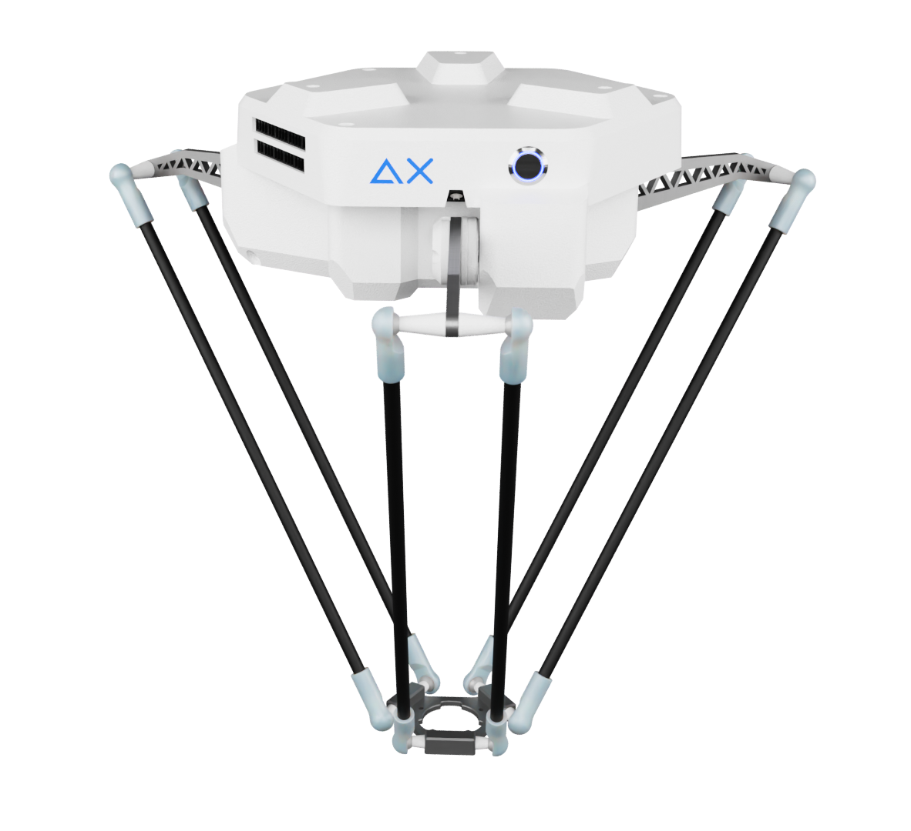

<<<<<<< HEAD
# Automated-Industrial_Parts_Picking_Robot
=======

# Automated Screw Sorting System
*Last updated: 21/03/2025*

## Overview
This project implements an automated system for sorting screws using computer vision and a robot arm. The system identifies different types of screws on a conveyor belt using a machine learning model, and sorts them into appropriate bins using a Delta robot.

## Features
- **Real-time Object Detection**: Uses YOLOv8 to detect and classify screws with high accuracy
- **Object Tracking**: Implements tracking to maintain object identity throughout frames
- **Rotated Bounding Box Detection**: Precisely identifies object orientation for better grip positioning
- **Camera-Robot Calibration**: Automated calibration for accurate coordinate mapping
- **Conveyor Belt Integration**: Synchronized operation with conveyor belt, including speed compensation
- **User-friendly Interface**: GUI for both automation and manual control

## System Requirements
- **Hardware**:
  - Delta Robot (Connect to COM3)
  - Basler Camera
  - Conveyor Belt System (Connect to COM11)
  - Position Encoder (Connect to COM6)
  - Computer with Python support
- **Software**:
  - Python 3.8+
  - Required libraries (see Installation section)

## Installation

1. Clone this repository:
   ```
   git clone [repository URL]
   ```

2. Install required dependencies:
   ```
   pip install -r requirements.txt
   ```
   
   Main dependencies include:
   - OpenCV
   - NumPy
   - PyPylon (for Basler camera)
   - PySerial
   - Ultralytics (YOLOv8)
   - Tkinter
   - PIL
   
3. Connect hardware:
   - Robot to COM3
   - Conveyor to COM11
   - Encoder to COM6
   - Connect the Basler camera via USB

## Usage

### Starting the System
1. Launch the application by running:
   ```
   python Robot_control/rbcontrol_demo.py
   ```

2. In the GUI:
   - Connect to the robot and conveyor using the provided connection panels
   - Select the appropriate COM ports
   - Choose one of the operational modes:

### Operating Modes

#### Auto Mode
1. Click "START" to begin automatic operation
2. The system will:
   - Detect screws on the conveyor belt
   - Classify them by type
   - Pick and place them into appropriate bins
   - Track the count of sorted screws
3. Click "STOP" to end the operation

#### Manual Mode
- **Camera Control**: Toggle camera on/off to view the conveyor belt
- **Robot Control**: Send the robot to home position, specific coordinates, or predefined positions
- **Gripper Control**: Operate the gripper mechanism
- **Conveyor Control**: Start/stop the conveyor belt
- **Custom G-code**: Send custom G-code commands for precise control
- **Pick and Place**: Manually specify coordinates and destination for pick and place operations

#### Calibration Mode
1. Click "START" in the Calibration tab
2. Click on the points in the camera view corresponding to the predefined real-world coordinates
3. After selecting all points, click "Update" to calculate and save the calibration matrix
4. The system will save the calibration parameters to `camera_transform.json`

## System Architecture

### Files and Directory Structure
- `Robot_control/rbcontrol_demo.py`: Main application code
- `Robot_control/camera_transform.json`: Camera-to-robot coordinate mapping matrix
- `Robot_control/calibration_parameters.json`: Camera calibration parameters
- `Robot_control/test_screws.pt`: Trained YOLOv8 model for screw detection
- `AI_training/`: Contains scripts for training and testing the object detection model
- `DATA/`: Training and testing datasets

### Key Components

#### Computer Vision System
- Uses YOLOv8 for object detection and classification
- Implements custom rotated bounding box detection for better orientation analysis
- Object tracking maintains identity across frames
- Camera undistortion and perspective transformation for accurate measurements

#### Robot Control System
- Coordinate mapping between camera and robot workspace
- Precise pick and place operations with speed and acceleration control
- Gripper control for secure object handling
- Error handling and recovery

#### User Interface
- Real-time camera view with object annotations
- Control panels for all system components
- Command response windows for system feedback
- Status indicators for system state

## Performance
- Can detect and classify different types of screws with high accuracy
- Compensates for conveyor belt movement when calculating pick positions
- Suitable for production environments with proper setup

## Troubleshooting
- If camera fails to connect, check USB connection and PyPylon installation
- If robot movements are inaccurate, recalibrate the system using the Calibration mode
- For conveyor issues, verify COM port settings and conveyor power

## Future Improvements
- Multi-camera support for better workspace coverage
- Enhanced error recovery mechanisms
- Integration with inventory management systems
- Support for additional screw types and objects


>>>>>>> 7c037f4 (Initial commit)
